# 第一章：Linux基础（实验）

## 软件环境
- 虚拟机：**Virtualbox**
  </br>
  Ubuntu 20.04 Server 64bit
- 宿主机：**Huawei Matebook 14**
  </br>
  Windows 10 家庭版
---
## 实验问题

1. 如何配置无人值守安装iso并在Virtualbox中完成自动化安装。

2. Virtualbox安装完Ubuntu之后新添加的网卡如何实现系统开机自动启用和自动获取IP？

3. 如何使用sftp在虚拟机和宿主机之间传输文件？

---

## 实验过程

### 配置无人值守安装iso并在Virtualbox中完成自动化安装
`Focal Fossa 无人值守安装 iso 制作过程 `

**实现特性**
- 定制一个普通用户名和默认密码
- 定制安装 OpenSSH Server

**主要操作步骤**

1. **提前下载好纯净版 Ubuntu 安装镜像 iso 文件**

此处在[官网](https://releases.ubuntu.com/focal/)下载，然后对比官方文档的sha256文件

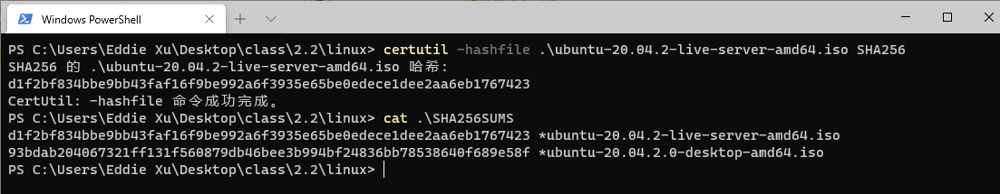

无误后先手动安装（跳过部分手动安装过程，中间我选择了lvm）


重启之后登陆成功

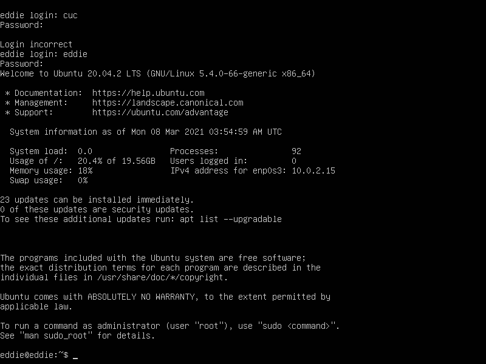

使用`ip a`命令查看当前网卡情况，发现都已经分配好了ipv4的地址

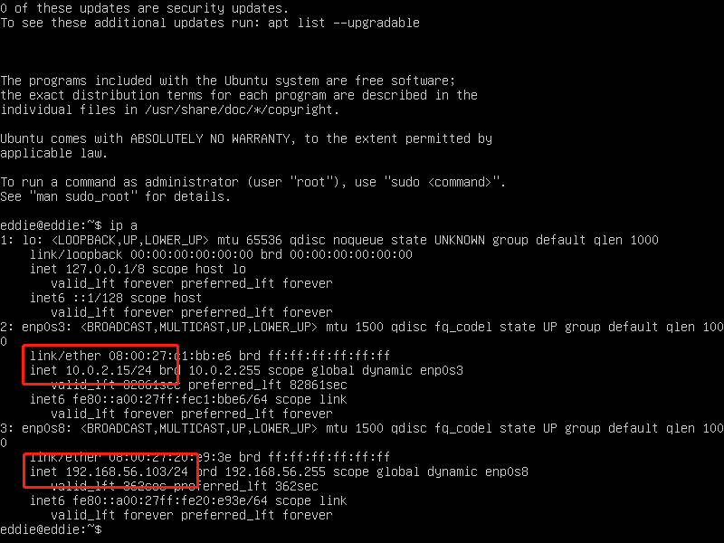

在服务器上安装 openssh-server

```
# 更新源并且安装 OpenSSH 服务器应用
sudo apt update && sudo apt install openssh-server
```

**网络配置**

这里用powershell生成4096位的密钥

`ssh-keygen -b 4096`

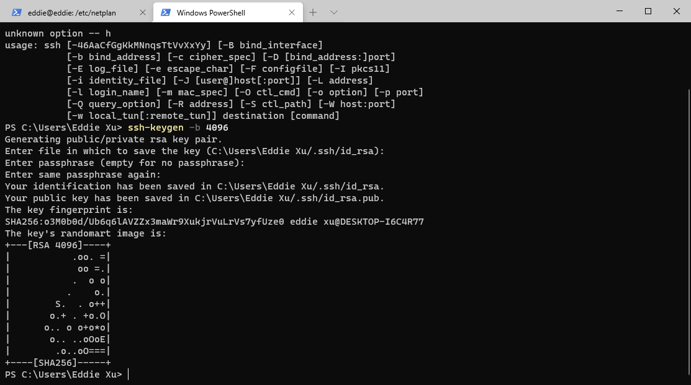

由于我是windows系统，所以只能用`git bash`来将密钥copy到虚拟机中
输入密码后，登陆成功

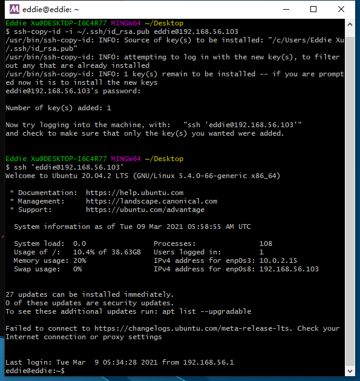

<br>

2. **使用手动安装 Ubuntu 后得到的一个初始「自动配置描述文件」**

在宿主机使用ssh服务连接到虚拟机

**这里我的宿主机上原先已经存在ssh服务，所以此处不再展示安装ssh服务的过程**


这里要注意需要使用sudo提权到root，才能查看该文件

`sudo cat /var/log/installer/autoinstall-user-data`

我们得到如下文件

```
#cloud-config
autoinstall:
  apt:
    geoip: true
    preserve_sources_list: false
    primary:
    - arches: [amd64, i386]
      uri: http://cn.archive.ubuntu.com/ubuntu
    - arches: [default]
      uri: http://ports.ubuntu.com/ubuntu-ports
  identity: {hostname: eddie, password: $6$8FhVWa2r1jr5/Zr9$e7Emqs/wCWISv3wzsiovqsyCQHBs6STu8NiOZtKaZeYZhnQIf./ZyDHIsENKVu0jHTq.8i1xXSxaqwdnl3Mhv/,
    realname: eddie, username: eddie}
  keyboard: {layout: us, toggle: null, variant: ''}
  locale: en_US
  network:
    ethernets:
      enp0s3: {dhcp4: true}
      enp0s8: {dhcp4: true}
    version: 2
  ssh:
    allow-pw: true
    authorized-keys: []
    install-server: true
  storage:
    config:
    - {ptable: gpt, serial: VBOX_HARDDISK_VB449a92b3-120f2aae, path: /dev/sda, wipe: superblock,
      preserve: false, name: '', grub_device: true, type: disk, id: disk-sda}
    - {device: disk-sda, size: 1048576, flag: bios_grub, number: 1, preserve: false,
      grub_device: false, type: partition, id: partition-0}
    - {device: disk-sda, size: 1073741824, wipe: superblock, flag: '', number: 2,
      preserve: false, grub_device: false, type: partition, id: partition-1}
    - {fstype: ext4, volume: partition-1, preserve: false, type: format, id: format-0}
    - {device: disk-sda, size: 84821409792, wipe: superblock, flag: '', number: 3,
      preserve: false, grub_device: false, type: partition, id: partition-2}
    - name: ubuntu-vg
      devices: [partition-2]
      preserve: false
      type: lvm_volgroup
      id: lvm_volgroup-0
    - {name: ubuntu-lv, volgroup: lvm_volgroup-0, size: 42408607744B, preserve: false,
      type: lvm_partition, id: lvm_partition-0}
    - {fstype: ext4, volume: lvm_partition-0, preserve: false, type: format, id: format-1}
    - {device: format-1, path: /, type: mount, id: mount-1}
    - {device: format-0, path: /boot, type: mount, id: mount-0}
  version: 1
```
使用 `scp`命令把这个文件拷贝到本地,在宿主机终端输入：

`scp eddie@192.168.56.103:/var/log/installer/autoinstall-user-data .\Desktop\class\2.2\linux\chap0x01\user-data`


然后观察自己安装的虚拟机和 [Autoinstall and Cloud-init Data](https://gist.github.com/bitsandbooks/6e73ec61a44d9e17e1c21b3b8a0a9d4c)（以下称“对比文件”） 中的user-data文件，发现他们分为几个类别，对比后发现：

- `apt`,`identity`,`keyboard`,选项在对比文件中没有出现
- `refresh-installer`自己安装的虚拟机中没有,对比文件中为`update: yes`
- `network`这一选项的格式和自己安装的虚拟机不太相同，对比文件在network下还嵌套一个network
- `ssh`这一选项下，对比文件有`allow-pw: no`，自己安装的是yes

然后又使用[Mergely](https://editor.mergely.com/)和老师提供的文件再进行一个对比：

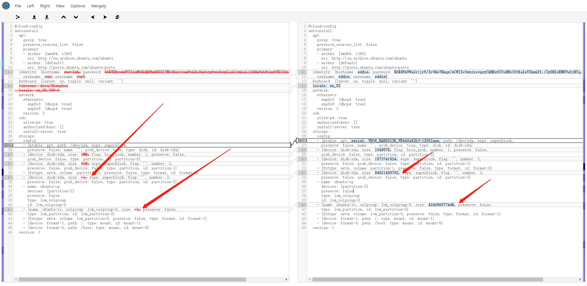

- `timezone: Asia/Shanghai` 新增时区为上海
- `locale` 设置成 `en_US.UTF-8`
- `serial: VBOX_HARDDISK_VB449a92b3-120f2aae`这一硬盘分区我们不需要，将其**删除**
- `device: disk-sda`,`device: disk-sda`的size设置成**人类可理解内容（比如1GB）**
- `name: ubuntu-lv`,`device: disk-sda` 的size都**设置成-1**

[这是自己配置好的user-data](./user-data)


3. 同手工安装系统步骤，新建可以用于安装 Ubuntu 64位系统 的虚拟机配置


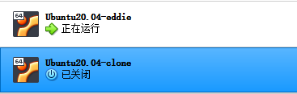

4. 参考 番外章节 Cloud-Init 实验目录中的说明文件 ，制作包含 user-data 和 meta-data 的 ISO 镜像文件，假设命名为 `focal-init.iso`

根据给出的镜像制作方法进行操作：

使用以下命令，把user-data文件传输到虚拟机中：

```
在虚拟机中：mkdir focal-clone && cd focal-clone
在宿主机中：scp 'C:\Users\Eddie Xu\Desktop\class\2.2\linux\chap0x01\user-data' eddie@192.168.56.103:/home/eddie/focal-clone
```

然后在虚拟机的新建一个mete-data文件：

```
cat << EOF > ~/focal-clone/meta-data
instance-id: docker-compose-debug
EOF
```

然后使用如下命令生成ISO文件：

```
genisoimage -output focal-clone.iso -volid cidata -joliet -rock user-data meta-data
```

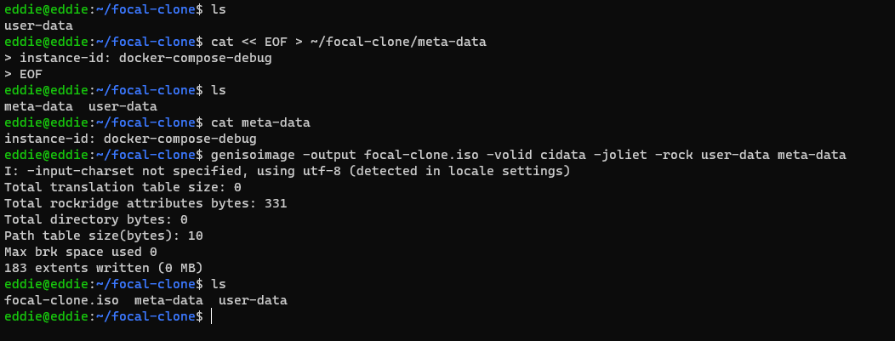


5. 移除上述虚拟机`「设置」-「存储」-「控制器：IDE」`

<br>

6. 在「控制器：SATA」下新建 2 个虚拟光盘，按顺序 先挂载「纯净版 Ubuntu 安装镜像文件」后挂载 focal-init.iso

(此处忘记截图)

7. 启动虚拟机，稍等片刻会看到命令行中出现以下提示信息。此时，需要输入 yes 并按下回车键，剩下的就交给「无人值守安装」程序自动完成系统安装和重启进入系统可用状态了

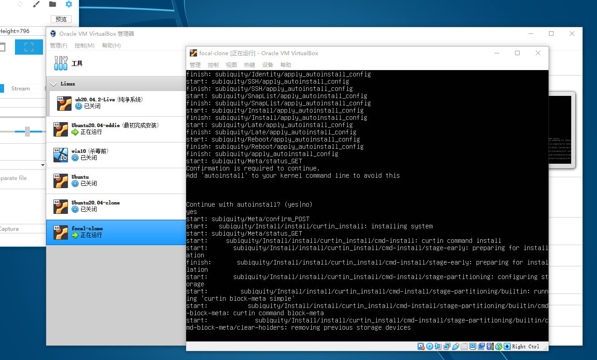

---

下面是我使用自己配置的的`focal-clone.iso`镜像按照上面的步骤进行的无人值守安装


**8min的自动安装过程我压缩成了11s，后面是按照正常的速度进行操作：登录，查看ip地址**

然后我将此磁盘文件设置成多重加载，重新开启了一个虚拟机，利用此多重加载镜像，能够迅速建立起一个新的虚拟机

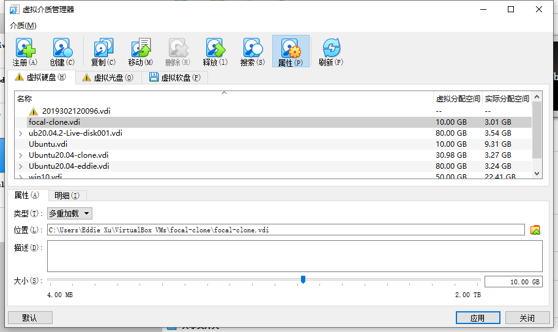


下面是我使用老师提供的`focal-init.iso`镜像按照上面的步骤进行的无人值守安装


**9min的自动安装过程我压缩成了8s，后面是按照正常的速度进行操作：登录，查看ip地址**

--- 

### Virtualbox安装完Ubuntu之后新添加的网卡如何实现系统开机自动启用和自动获取IP？

**主要操作步骤**
1. 新建一块网卡

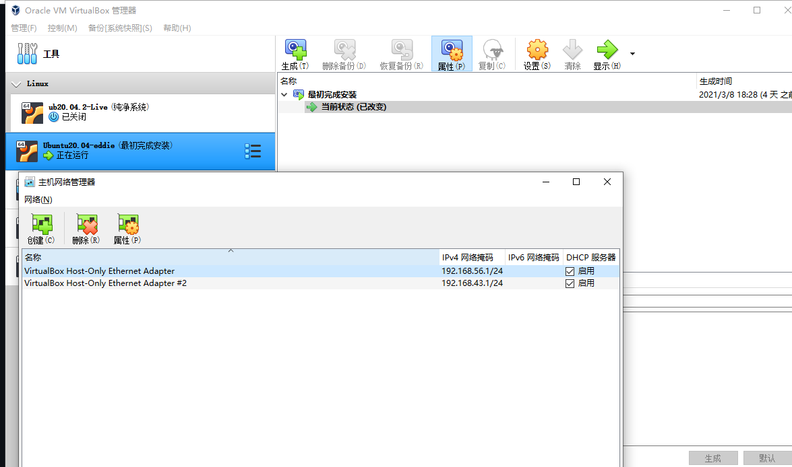

2. 在关闭虚拟机之后添加新的网卡，设置为host-only模式

3. 检查新建网卡情况，发现并没有分配ip地址

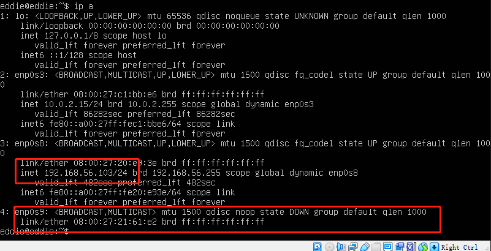

4. 修改 **00-installer-config.yaml** 文件配置

`sudo vim /etc/netplan/00-installer-config.yaml`

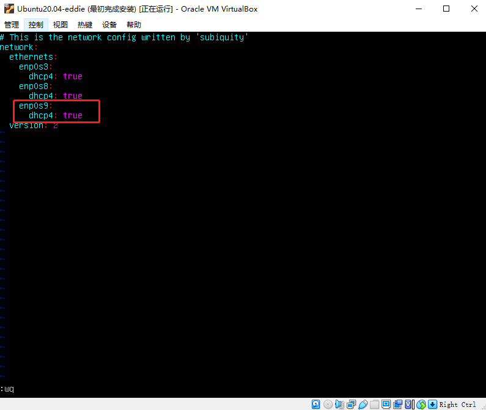

5. `sudo netplan apply` 重新应用刚才的网络配置

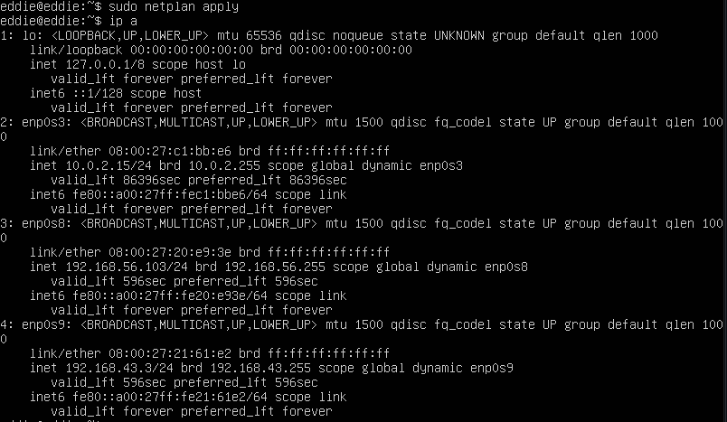

6. 重启以后发现新装的网卡能够自动分配ip地址

```
sudo reboot
ip a
```

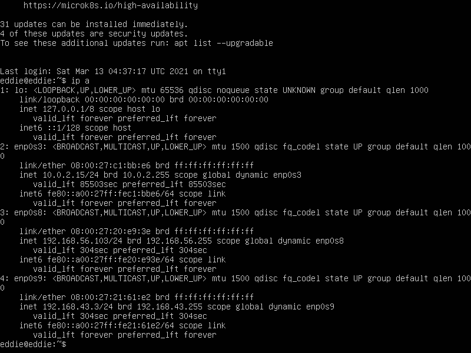

---

### 如何使用sftp在虚拟机和宿主机之间传输文件？
 
宿主机安装ssh服务后，使用scp即可传输文件

|传输方向|举例（都是在宿主机终端实现）|
|---|---|
|Windows→Linux|scp ~\Desktop\class\2.2\linux\chap0x01\user-data eddie@192.168.56.103:/home/eddie/focal-clone|
|Linux→Windows|scp eddie@192.168.56.103:/home/eddie/workspace/cloud-init/focal-clone.iso ~\Desktop\class\2.2\linux\chap0x01\user-data|

以下是sftp的使用语法（需要先安装好ssh服务）：

```
# 连接远程服务器
sftp root@192.168.25.140
# 上传文件
put 当前路径  远程连接
# 下载文件
get 远程路径  当前路径
```
---

## 遇到的问题以及解决办法

1. 对于一些文件出现的`permission deny`的情况，需要进行提权操作，做法是`sudo 要执行的操作`
然后输入密码

1. 宿主机已经安装openssh服务，也能够通过ssh登录到虚拟机之中，但是从虚拟机向宿主机传输文件却显示connection refused，检查了宿主机ssh服务，但没有发现什么问题。我以为是使用ssh连接虚拟机会造成端口占用，然后不使用ssh服务直接在虚拟机发送文件，还是显示同样的结果。
解决办法：
```
scp eddie@192.168.56.103:/home/eddie/workspace/cloud-init/focal-clone.iso ./
```


## 参考文献
* [课堂录像](https://www.bilibili.com/video/BV1Hb4y1R7FE?p=28)
* [老师的课件仓库](https://github.com/c4pr1c3/LinuxSysAdmin/tree/master/exp/cloud-init/docker-compose)
* [hdiutil官方文档](https://ss64.com/osx/hdiutil.html)
* [NoCloud官方文档](https://cloudinit.readthedocs.io/en/latest/topics/datasources/nocloud.html)
* [genisoimage用法](https://wiki.debian.org/genisoimage)
* [Ubuntu 20.04 + autoinstall + VirtualBox](https://gist.github.com/bitsandbooks/6e73ec61a44d9e17e1c21b3b8a0a9d4c)
* [吕师哥之前的markdown](https://github.com/CUCCS/linux-2020-LyuLumos/blob/ch0x01/ch0x01/%E7%AC%AC%E4%B8%80%E6%AC%A1%E5%AE%9E%E9%AA%8C%E6%8A%A5%E5%91%8A.md)


