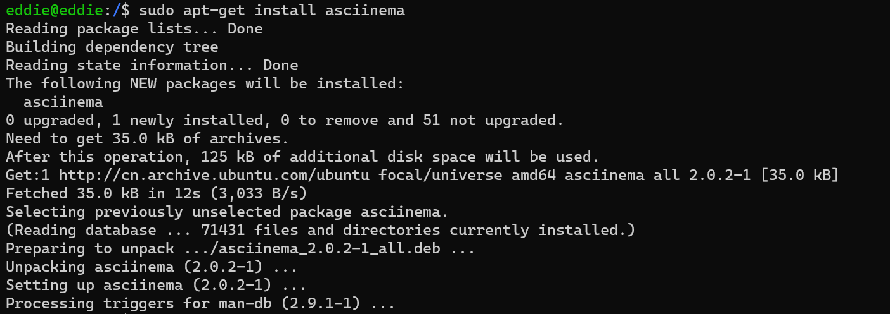
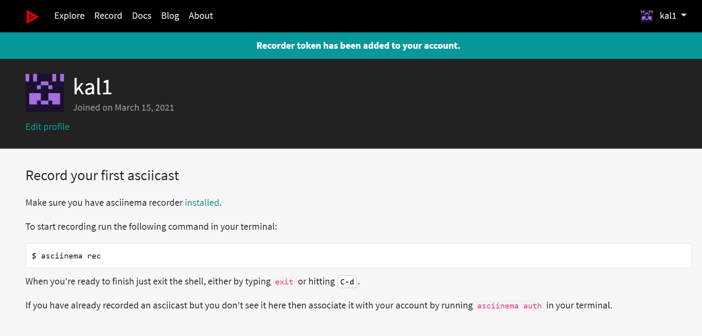

# 第二次实验
## vimtutor的学习与使用

# 软件环境
- 虚拟机：**Virtualbox**
  Ubuntu 20.04 Server 64bit
- 软件环境：**asciinema，vim**

## 安装asciinema
```bash
sudo apt-add-repository ppa:zanchey/asciinema
sudo apt-get update
sudo apt-get install asciinema
```




在网页上登陆账号后在终端执行`asciinema auth`

```bash
eddie@eddie:~$ asciinema auth
Open the following URL in a web browser to link your install ID with your asciinema.org user account:

https://asciinema.org/connect/bc1c325d-1226-42af-a12f-8944b20c9ee1

This will associate all recordings uploaded from this machine (past and future ones) to your account, and allow you to manage them (change title/theme, delete) at asciinema.org.

```

然后在已登录的界面输入`https://asciinema.org/connect/bc1c325d-1226-42af-a12f-8944b20c9ee1`即可查看自己录制的命令行视频

---


# 实验过程

## 各小节学习过程录屏

- Lesson 1 vimtutor的基本使用
[](https://asciinema.org/a/zGsBEsUweKWOH54o1XtNCWwjt)

- Lesson 2 学习删除、撤销的操作
[](https://asciinema.org/a/lmQpQhlrXEe3DyuS1Fu2ShW67)

- Lesson 3 学习修改、替换字符、行
[](https://asciinema.org/a/6xbwiNttquVpNjnBtND2eNF2f)

- Lesson 4 学习文本的搜索和替换
[](https://asciinema.org/a/GBKArxjg5dg98IkOVw2GewzZM)

- Lesson 5 学习了在vim中执行shell命令，新建文件等操作
[](https://asciinema.org/a/8t6y6afacv9LT68f513PuPRHr)

- Lesson 6 学习了插入行，复制，粘贴等操作
[](https://asciinema.org/a/hRQH3OCk4ka9DH4waLIL2mE0w)

- Lesson 7 学习了vim的帮助和编写脚本等
[](https://asciinema.org/a/DXdqIjwjGBL107MEt6BDOCHt8)


--- 


# vimtutor完成后的自查清单


1. 你了解vim有哪几种工作模式？

- insert 插入模式
- visual 可视模式
- normal 普通模式
- cmd-line 命令行模式

2. Normal模式下，从当前行开始，一次向下移动光标10行的操作方法？如何快速移动到文件开始行和结束行？如何快速跳转到文件中的第N行？

|目标操作|方法|
|--|--|
|从当前行开始，一次向下移动光标10行|10j|
|快速移动到文件开始行|gg|
|快速移动到文件结束行|G|
|快速跳转到文件中的第N行|:N|

3. Normal模式下，如何删除单个字符、单个单词、从当前光标位置一直删除到行尾、单行、当前行开始向下数N行？

|目标操作|方法|
|--|--|
|删除单个字符|dl或x|
|删除单个单词|dw|
|从当前光标位置一直删除到行尾|d$|
|从当前光标位置删除单行|dd|
|从当前行开始删除下面N行|Ndd|

4. 如何在vim中快速插入N个空行？如何在vim中快速输入80个-？

- No或者NO能够快速插入N个空行，但是需要按下esc之后才能生效
- 普通模式下输入'80i-'然后'ESC' 


5. 如何撤销最近一次编辑操作？如何重做最近一次被撤销的操作？

- 撤销最近一次编辑操作：在normal模式下按u；

- 重做最近一次被撤销的操作：键入: CTRL-R
 

6. vim中如何实现剪切粘贴单个字符？单个单词？单行？如何实现相似的复制粘贴操作呢？
 
- 剪切粘贴单个字符: 在想要剪切的字符前使用'x'，在想要粘贴的字符前'p'

- 单个单词: 在想要剪切的单词前使用'dw'，在想要粘贴的单词前'p'

- 单行: 'dd'然后'p'

- 实现相似的复制粘贴操作：按v进入可视模式visual mode，移动光标选择需要复制的内容，按y复制文本，移动光标至指定位置，然后按下p粘贴文本
 

7. 为了编辑一段文本你能想到哪几种操作方式（按键序列）？

- 插入文本类命令：
  - i: 在光标前
  - I: 在当前行首
  - a: 光标后
  - A: 在当前行尾
  - o: 在当前行之下新开一行
  - O: 在当前行之上新开一行

- 删除文本类命令：
  - do: 删至行首
  - d$: 删至行尾
  - ndd: 删除当前行及其后n-1行
  - x或X: 删除一个字符，x删除光标后的，而X删除光标前的

- 复制粘贴文本类命令：
  - v,y,p的组合操作

- 撤销与重做:
  - u：撤销最近一次操作
  - CTRL-R：重做最后一次被撤销的操作

- 保存更改：
  - :w ：保存刚才的更改

- 退出vim：
  - :q! :退出当前文件并放弃一切修改
  - :wq!:退出当前文件并保存一切修改
 

8. 查看当前正在编辑的文件名的方法？查看当前光标所在行的行号的方法？
 
- 用 :f 可以看文件名，用 :!pwd  可以看当前的详细路径。

- 显示行号：: set nu  取消显示行号：: set nonu
 

9. 在文件中进行关键词搜索你会哪些方法？如何设置忽略大小写的情况下进行匹配搜索？如何将匹配的搜索结果进行高亮显示？如何对匹配到的关键词进行批量替换？

- 关键词搜索：/想要查找的关键词，然后按下回车

- 忽略大小写：set ic

- 将匹配结果高亮显示: set hls is

- 匹配到的关键词进行批量替换:
  - 全局替换：'%s/old/new/g'
  - 对指定行数（m-n）进行替换：:m,ns/old/new/g

 

10. 在文件中最近编辑过的位置来回快速跳转的方法？

- Normal 模式下执行 CTRL-O 和 CTRL-I
 

11. 如何把光标定位到各种括号的匹配项？例如：找到(, [, or {对应匹配的),], or }
 
- 先将光标定位到任一的(,[,{ ，键入 % 以找到所匹配的),],}
 

12. 在不退出vim的情况下执行一个外部程序的方法？
 
- 按 :! 并加上要执行的外部命令。
 

13. 如何使用vim的内置帮助系统来查询一个内置默认快捷键的使用方法？如何在两个不同的分屏窗口中移动光标？
 
- :help[快捷键名] + enter

- 在不同的分屏窗口移动光标，通过  :set mouse=a
开启vim鼠标支持模式，然后就可以移动光标了 
 
 