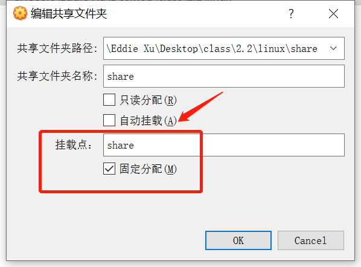
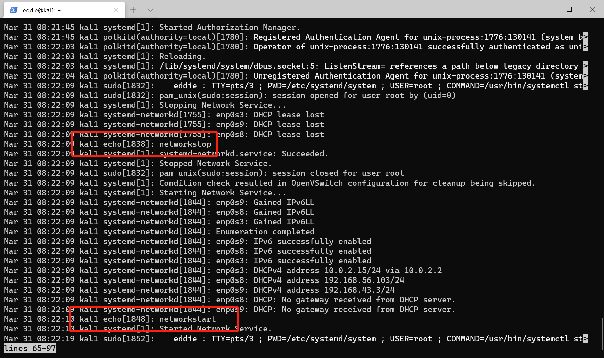

# 第三次实验报告

# 实验环境
- 虚拟机：**Virtualbox**
  Ubuntu 20.04 Server 64bit
- 软件环境：**asciinema，Windows10--powershell**

# 实验过程

## 视频录制

**由于实验过程是边阅读边理解思考，所以有些操作中间会有一些间隔，可以按快进键⏩加速，不会影响观看效果**

---

### 系统管理

systemd-analyze、hostnamectl、localectl、timedatectl、loginctl相关命令的使用

[](https://asciinema.org/a/7Q8lWixp2PYYIwlHd8BhwFTeg)

注：
1. `systemctl是 Systemd 的主命令，用于管理系统。`相关的重启系统、关闭系统等命令操作过后录屏进程同会结束，所以在录屏中没有体现出来

2. 在改变时间时报错
```bash
Failed to parse time specification 'YYYY-MM-DD': Invalid argument

Failed to parse time specification 'HH:MM:SS': Invalid argument
```
后来查询到解决办法，需要直接输入一个数字的形式，比如`sudo timedatectl set-time 2021-3-29`

但是这样直接输入也不行

```bash
Failed to set time: Automatic time synchronization is enabled
```

需要先关闭时间同步

`timedatectl set-ntp no`

然后输入密码，再执行上面的命令

`sudo timedatectl set-time 2021-3-29`

再开启时间同步

`timedatectl set-ntp yes`

修改成功

---

### Unit

Systemd 可以管理所有系统资源。不同的资源统称为 Unit（单位）。Unit 一共分成12种。

[](https://asciinema.org/a/AavW1bIfPTcdfuon6ZlW8PBWY)

---

### Unit 的配置文件

每一个 Unit 都有一个配置文件，告诉 Systemd 怎么启动这个 Unit。学习相关内容

[](https://asciinema.org/a/m4PEs0wwKUmUSGjOQP0uTBULC)

---

### Target

启动计算机的时候，需要启动大量的 Unit。如果每一次启动，都要一一写明本次启动需要哪些 Unit，显然非常不方便。Systemd 的解决方案就是 Target。

[](https://asciinema.org/a/QovuJOIgexvpSjb0eCcA2kNIr)

---

### 日志管理

Systemd 统一管理所有 Unit 的启动日志。

[](https://asciinema.org/a/gQ5q8n6misz2XSssKjUwyGAK0)


注：
1. `Failed to parse vacuum size: = ` 出现的这个问题，是格式问题。
  `sudo journalctl --vacuum-size = 1G`这一命令不能等号前后不能出现空格
2. ` Failed to parse vacuum size: 1years`                                    
`sudo journalctl --vacuum-size=1years`这里是没有看清楚命令参数，直接按上下键切换，这里需要`--vacuum-time=1year`,不是`size`


---

### 开机启动、启动服务、停止服务、查看配置文件

[](https://asciinema.org/a/zWhaDq3QhX9pmXwbCvhgtLjjv)

---

### [Install] 区块、Target 的配置文件、修改配置文件后重启

[![[Install] 区块、Target 的配置文件、修改配置文件后重启](https://asciinema.org/a/MacMaT6QKl3BosMazrRQIalxj.svg)](https://asciinema.org/a/MacMaT6QKl3BosMazrRQIalxj)


---

# 本章完成后的自查清单

1. 如何添加一个用户并使其具备sudo执行程序的权限？

- **先用adduser命令创建用户，然后把新建的用户加入到sudo组里面,就可以看到新建用户在sudo组里面了**
- ```bash
  sudo adduser xzl
  sudo usermod -G sudo -a xzl
  ```
```bash
eddie@kal1:~$ sudo adduser xzl
[sudo] password for eddie:
Adding user `xzl' ...
Adding new group `xzl' (1001) ...
Adding new user `xzl' (1001) with group `xzl' ...
Creating home directory `/home/xzl' ...
Copying files from `/etc/skel' ...
New password:
Retype new password:
passwd: password updated successfully
Changing the user information for xzl
Enter the new value, or press ENTER for the default
        Full Name []:
        Room Number []:
        Work Phone []:
        Home Phone []:
        Other []:
Is the information correct? [Y/n] y

eddie@kal1:~$ sudo usermod -G sudo -a xzl
eddie@kal1:~$ sudo cat /etc/group
root:x:0:
daemon:x:1:
bin:x:2:
sys:x:3:
adm:x:4:syslog,eddie
tty:x:5:syslog
disk:x:6:
lp:x:7:
mail:x:8:
news:x:9:
uucp:x:10:
man:x:12:
proxy:x:13:
kmem:x:15:
dialout:x:20:
fax:x:21:
voice:x:22:
cdrom:x:24:eddie
floppy:x:25:
tape:x:26:
sudo:x:27:eddie,xzl
audio:x:29:
dip:x:30:eddie
www-data:x:33:
backup:x:34:
operator:x:37:
list:x:38:
irc:x:39:
src:x:40:
gnats:x:41:
shadow:x:42:
utmp:x:43:
video:x:44:
sasl:x:45:
plugdev:x:46:eddie
staff:x:50:
games:x:60:
users:x:100:
nogroup:x:65534:
systemd-journal:x:101:
systemd-network:x:102:
systemd-resolve:x:103:
systemd-timesync:x:104:
crontab:x:105:
messagebus:x:106:
input:x:107:
kvm:x:108:
render:x:109:
syslog:x:110:
tss:x:111:
uuidd:x:112:
tcpdump:x:113:
ssh:x:114:
landscape:x:115:
lxd:x:116:eddie
systemd-coredump:x:999:
eddie:x:1000:
ssl-cert:x:117:
xzl:x:1001:
```

2. 如何将一个用户添加到一个用户组？

- usermod -a -G groupA user
需要加上-a参数，否则会使你离开其他用户组，仅仅做为用户组 groupA 的成员。

3. 如何查看当前系统的分区表和文件系统详细信息？

- df -hT 只可以查看已经挂载的分区和文件系统类型。
- fdisk -l 可以显示出所有挂载和未挂载的分区，但不显示文件系统类型。
- gdisk -l 同样也可
- parted -l 可以查看未挂载的文件系统类型，以及哪些分区尚未格式化。大于2TB分区支持使用此
- lsblk -f 也可以查看未挂载的文件系统类型

4. 如何实现开机自动挂载Virtualbox的共享目录分区？

- 在windows下创建一个共享文件夹
- 配置共享文件夹（不点击自动挂载）
- 在虚拟机中新建共享文件夹 /mnt/share
- 执行挂载命令 ```sudo mount -t vboxsf [Windows共享文件夹名称] /mnt/dirname```
- 修改 /etc/fstab 文件 在文末添加```[Windows共享文件夹名称] /mnt/dirname/ vboxsf defaults 0 0```即可完成开机自动挂载

[](https://asciinema.org/a/vVDzr8U4deSESzXEaEySD3z6U)

注：

-  **这个视频是在完成前4步后重启虚拟机导致的，所以相关步骤的录制丢失了（没有及时exit），所以现在的视频是查看刚才已挂载好的路径并且设置开机自动挂载的视频**

- 遇到的问题：
`/sbin/mount.vboxsf: mounting failed with the error`
解决办法：
  记得设置挂载点的名字，同时不要选择自动挂载
- 遇到的问题
 `mount: /mnt/xxx: wrong fs type, bad option, bad superblock on xxx...`
 解决办法：`sudo apt-get install virtualbox-guest-utils`


5. 基于LVM（逻辑分卷管理）的分区如何实现动态扩容和缩减容量？

由于要求是基于LVM的分区，所以是LV层次的修改

```bash
分区扩容
lvresize --size +{{120G}} --resizefs {{volume_group}}/{{logical_volume}}
lvresize --size {{100}}%FREE {{volume_group}}/{{logical_volume}}
lvextend -L size

分区缩减（可能会由于缩减后存储容量不足导致数据丢失）
lvresize --size -{{120G}} --resizefs {{volume_group}}/{{logical_volume}}
lvreduce -L size

```
6. 如何通过systemd设置实现在网络连通时运行一个指定脚本，在网络断开时运行另一个脚本？

- 写一个脚本用于网络连通时运行,然后设置开机启动

  `vim /usr/lib/systemd/system/after_networking.service`

- 以下是修改内容

  ```bash
  [Unit]
  Description=after networking 
  After=networking.service # 网络启动之后
  [Service]
  Type=oneshot # 执行一次
  ExecStart=/bin/bash -e  {{目标脚本路径}}
  KillSignal=SIGINT
  [Install]
  WantedBy=multi-user.target
  ```

或者直接在`systemd-networkd.service`修改

[](https://asciinema.org/a/NqWpQlKQle4Lf3FMO7andzNNU)

注：

**`/bin/echo` 后面显示的内容需要在日志里面查看**



7. 如何通过systemd设置实现一个脚本在任何情况下被杀死之后会立即重新启动？实现杀不死？

- 修改配置文件[service]区块，将**restart**设置为**always**
- ```bash
  [Service]
  Restart = always
  ```
- 然后重新加载配置文件`sudo systemctl daemon-reload`
- 重新启动服务`sudo systemctl restart ××××`

---

# 参考资料
* [Linux 的启动流程](http://www.ruanyifeng.com/blog/2013/08/linux_boot_process.html)
* [Systemd 入门教程：命令篇](http://www.ruanyifeng.com/blog/2016/03/systemd-tutorial-commands.html)
* [Systemd 入门教程：实战篇](http://www.ruanyifeng.com/blog/2016/03/systemd-tutorial-part-two.html)
* [#!/bin/bash的参数-e](https://blog.csdn.net/suwenqiang_2011/article/details/8025825)
* [在Virtualbox下为Ubuntu20.04开机自动挂载共享目录的方法](https://www.yehe.org/article/350078.html)