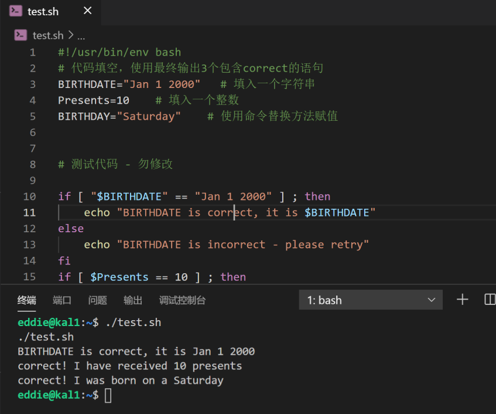
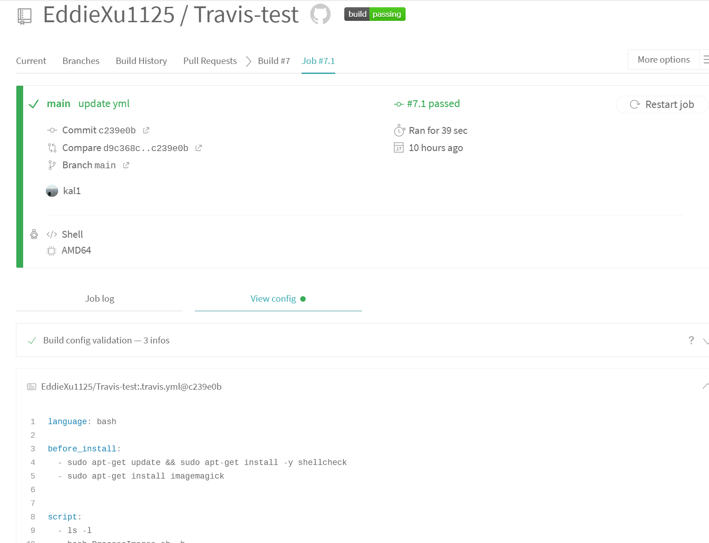
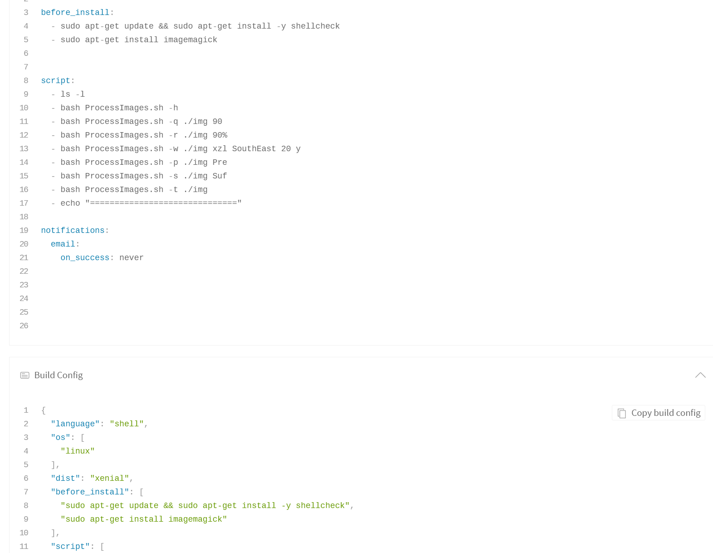
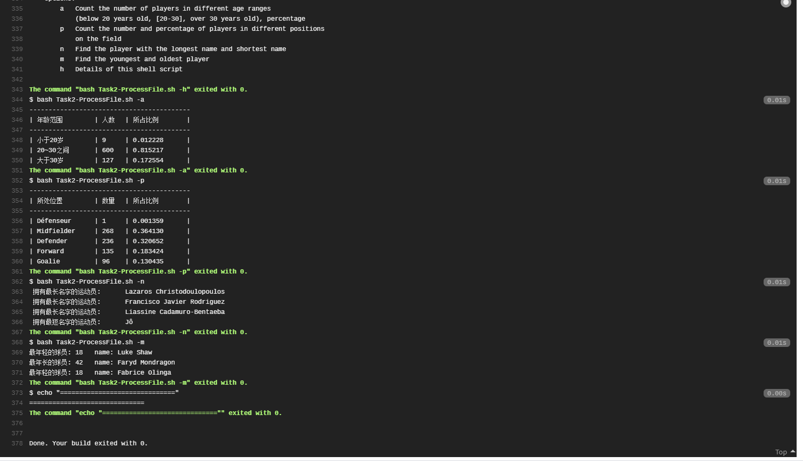
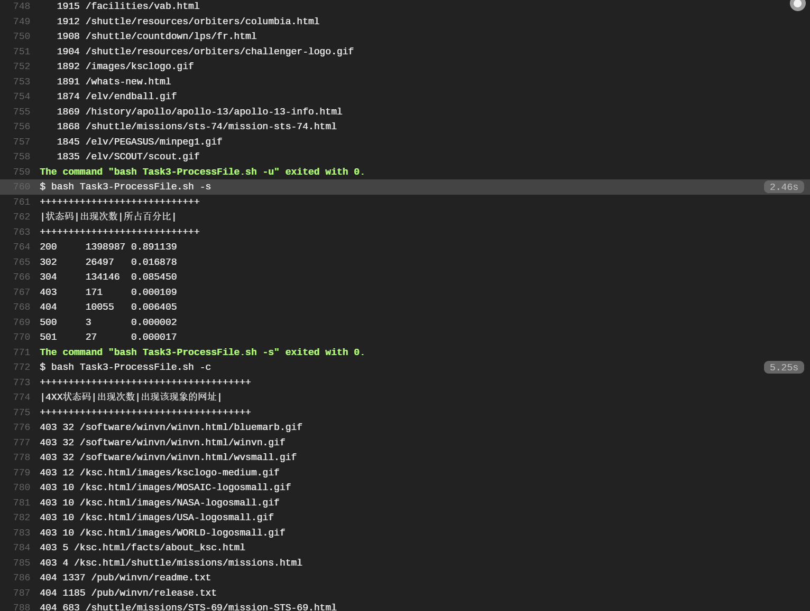

# 第四次实验

## 实验环境
- 虚拟机：**Virtualbox**
  Ubuntu 20.04 Server 64bit
- 软件环境：**VScode,连接到虚拟机**
    - ShellCheck
    - Bash Debug
    - Bash IDE


---

## 实验要求
1. 上述任务的所有源代码文件必须单独提交并提供详细的`--help`脚本内置帮助信息
2. 任务二\三的所有统计数据结果要求写入独立实验报告


---


## 完成情况

#### 任务一：用bash编写一个图片批处理脚本，实现以下功能：
- [x] 支持命令行参数方式使用不同功能
- [x] 支持对指定目录下所有支持格式的图片文件进行批处理
- [x] 支持以下常见图片批处理功能的单独使用或组合使用
  - [x] 支持对jpeg格式图片进行图片质量压缩
  - [x] 支持对jpeg/png/svg格式图片在保持原始宽高比的前提下压缩分辨率
  - [x] 支持对图片批量添加自定义文本水印
  - [x] 支持批量重命名（统一添加文件名前缀或后缀，不影响原始文件扩展名）
  - [x] 支持将png/svg图片统一转换为jpg格式图片

#### 任务二：用bash编写一个文本批处理脚本，对以下附件分别进行批量处理完成相应的数据统计任务：

- [x] 统计不同年龄区间范围（20岁以下、[20-30]、30岁以上）的球员数量、百分比
- [x] 统计不同场上位置的球员数量、百分比
- [x] 名字最长的球员是谁？名字最短的球员是谁？
- [x] 年龄最大的球员是谁？年龄最小的球员是谁？

#### 任务三：用bash编写一个文本批处理脚本，对以下附件分别进行批量处理完成相应的数据统计任务：

- [x] 统计访问来源主机TOP 100和分别对应出现的总次数
- [x] 统计访问来源主机TOP 100 IP和分别对应出现的总次数
- [x] 统计最频繁被访问的URL TOP 100
- [x] 统计不同响应状态码的出现次数和对应百分比
- [x] 分别统计不同4XX状态码对应的TOP 10 URL和对应出现的总次数
- [x] 给定URL输出TOP 100访问来源主机


---


## 实验过程

### 课堂实验

1. 变量
```bash
#!/usr/bin/env bash
BIRTHDATE="Jan 1 2000"   # 填入一个字符串
Presents=10    # 填入一个整数
BIRTHDAY="Saturday"    # 使用命令替换方法赋值
```


2. 数组
```bash
NUMBERS=$(seq 1 10)  # 构造包含1到10整数的数组
STRINGS=("hello" "world")  # 构造分别包含hello和world字符串的数组
NumberOfNames=${#NAMES[@]} # 请使用动态计算数组元素个数的方法
second_name='Eric'  # 读取NAMES数组的第2个元素值进行赋值
```

**出现的问题与解决办法**
`${T_NUMBERS[@]}`报错标红`'Double quote array expansions to avoid re-splitting elements.'`需要加上双引号
```bash
i=0
for n in "${T_NUMBERS[@]}";do
  if [[ "${n}" -ne "${NUMBERS[${i}]}" ]];then
    echo "failed in NUMBERS test"
  fi
  i=$((i+1))
done
```


3. 求2个数的最大公约数，要求：

- 通过命令行参数读取2个整数，对不符合参数调用规范（使用小数、字符、少于2个参数等）的脚本执行要给出明确的错误提示信息，并退出代码执行

心路历程：
```bash
#思路一：黑名单，对不同输入进行不同的报错并退出
#思路二：白名单，进行正则匹配，只有满足输入的两个参数是整数才可以运行下一步


#!/bin/bash
function cal_gcd(){
    m=$1
    if [[ $2 -lt $m ]]; then
    m=$2
    fi
    while [[ $m -ne 0 ]]; do
        x=$($1 % "$m")
        y=$($2 % "$m")
        if [[ $x -eq 0 && $y -eq 0 ]];then
            echo "gcd of $1 and $2 is $m"
            break
    fi
    m=$($m - 1)
    done
}

if [[ "$#" -ne 2 ]];then
    echo "The number of input must be 2"
# elif [[ false ]];then
#     echo ""
else 
    cal_gcd "$1" "$2"
fi


```


---


### 课后实验

**1. 任务一**

**①支持命令行参数方式使用不同功能**

使用`getopts`进行处理，参考资料见报告末

**②支持对指定目录下所有支持格式的图片文件进行批处理**

```bash
对某些特定类型图像进行处理时需要判断格式，有两种处理办法
1.读取文件的魔数，但是遇到有些文件没有魔数的时候就不好办了
2.使用magick里面的命令 identify -format "%m" 文件名
  能够得到文件的类型，即使改了后缀也可以看真正的类型
```

**③支持以下常见图片批处理功能的单独使用或组合使用**

```bash
#对jpeg格式图片进行图片质量压缩
convert -strip -interlace Plane -gaussian-blur 0.01 -quality "$Q" "$jpg" "$jpg"

#对jpeg/png/svg格式图片在保持原始宽高比的前提下压缩分辨率
convert -resize "$R" "$img" "$img"

#支持对图片批量添加自定义文本水印
#加非透明水印时
convert "${img}" -pointsize "$size" -fill 'rgba(221, 34, 17, 0.25)' \
-gravity "$position" -draw "text 10,10 '$content'" "${img}"

#加透明水印时
convert  -size 100x100  xc:none  \
-fill '#d90f02'  -pointsize "$size"  -font 'cochin.ttc'  \
-gravity "$position" -draw "rotate -45 text 0,0 '$content'"  \
-resize 60%  miff:-  |  composite  -tile  -dissolve 25  -  "$img"  "$img"


#支持批量重命名（统一添加文件名前缀或后缀，不影响原始文件扩展名）
#添加前缀
name=${img##*/}
new_name=$1"/"${prefix}${name}
mv "${img}" "${new_name}"
#添加后缀
new_name=${img%.*}${suffix}"."${type}
mv "${img}" "${new_name}"

#支持将png/svg图片统一转换为jpg格式图片
new_img=${img%.*}".jpg"
convert "${img}" "$new_img"

```


在Travis-CI测试





---

**2. 任务二**

**①统计不同年龄区间范围（20岁以下、[20-30]、30岁以上）的球员数量、百分比**

```bash
if ($6<20) {small++;}
else if ($6<=30) {middle++;}
else {high++;}
```

**②统计不同场上位置的球员数量、百分比**

```bash
NR>1 {
        position[$5]++;
        total++;
    }
```


**③名字最长的球员是谁？名字最短的球员是谁？**

```bash

#本来是想用awk内置函数asort对其进行排序，但是像下面这样的语句输出为0，找了好久原因但不知为何

FindName(){
    awk -F '\t'  'BEGIN{ 
    age[$9]=length($9);       
    for(i=1;i<=asort(age,nage);i++){
    	print i "\t" nage[i]
	}}
    NR>1 {                    
    }
    END{           
        printf("------------------------------------------\n")
        printf("| 拥有最长名字的运动员\t | 拥有最短名字的运动员\t | \n")
        printf("------------------------------------------\n")       

    }'  worldcupplayerinfo.tsv
    exit 0
}

# 于是换了下面的写法

awk -F '\t' 'BEGIN{ max=0; min=100; }
    NR>1 { 
        let=length($9);
        names[$9]=let;
        max=let>max?let:max;
        min=let<min?let:min; 
    }        
    END{
        for(i in names){            
            if(names[i]==max){
                print " 拥有最长名字的运动员:\t "i
            }
            else if(names[i]==min){
                print " 拥有最短名字的运动员:\t "i 
            }
        }
    } ' worldcupplayerinfo.tsv
```


**④年龄最大的球员是谁？年龄最小的球员是谁？**

```bash
    awk -F '\t' 'BEGIN{ max=0; min=100; }
    NR>1 {
        ages[$9]=$6;
        max=$6>max?$6:max;
        min=$6<min?$6:min;
    }
    END{
        for(i in ages){
            if(ages[i]==max){
                print "最年长的球员: "ages[i]"\t name: " i "\t";
            }
            else if(ages[i]==min){
                print "最年轻的球员: "ages[i]"\t name: " i "\t";
            }
        }
    }' worldcupplayerinfo.tsv
```


**注：**

1. `awk`的执行语句（单引号所包围的）一定要和awk 放在一行，不然会报错

2. 下载的文件链接为`https://github.com/EddieXu1125/LinuxSysAdmin/blob/master/exp/chap0x04/worldcupplayerinfo.tsv` 时得到的是一个html内容（虽然是tsv后缀），改为了`https://raw.githubusercontent.com/EddieXu1125/LinuxSysAdmin/master/exp/chap0x04/worldcupplayerinfo.tsv`

3. The "NR > 1" is true only for lines greater than one, so it does not get executed on the first line. On the first line only the "1", the true statement, gets executed. It makes Awk print the line and read the next line.

   略去文件第一行，往后读取  


---

在Travis-CI测试



**3. 任务三**

**①统计访问来源主机TOP 100和分别对应出现的总次数**

```bash
awk -F '\t' '
    NR>1{hosts[$1]++;}
    END{      
        for( host in hosts ){
            print hosts[host] "\t|" host "\t\n";
        }
    }
    ' web_log.tsv | sort -k1 -rg | head -100

```


**②统计访问来源主机TOP 100 IP和分别对应出现的总次数**

```bash
awk -F '\t' '
    NR>1 { 
        if(match($1,/^[0-9]{1,3}\.[0-9]{1,3}\.[0-9]{1,3}\.[0-9]{1,3}$/)){
            hosts[$1]++; 
        }          
    }
    END{ 
        for(host in hosts){
            print hosts[host] "\t" host "\t\n";
        }
    }' web_log.tsv | sort -k1 -rg | head -100

```


**③统计最频繁被访问的URL TOP 100**

```bash
awk -F '\t' '
    NR>1{
        print $5
    }
    ' web_log.tsv | sort | uniq -c | sort -nr | head -100
    # # sort按照数值来排序(倒序)

```


**④统计不同响应状态码的出现次数和对应百分比**

```bash
awk -F '\t' 'BEGIN{total=0}
    NR>1{
        state[$6]++;
        total++;
    }
    END{
        for( s in state ){
            printf("%s\t%d\t%.6f\t\n",s,state[s],state[s]/total) 
        }

    }' web_log.tsv 
```


**⑤分别统计不同4XX状态码对应的TOP 10 URL和对应出现的总次数**

```bash
awk -F '\t' '
    NR>1{
        if(match($6,/^4[0-9]{2}$/)){
            urls[$6][$5]++;
        }
    }
    END{ 
        for(k1 in urls){
            for(k2 in urls[k1]){
                print k1, urls[k1][k2], k2;
            }
        }
    }' web_log.tsv | sort -k1,1 -k2,2gr | head -10
    
awk -F '\t' '
    NR>1{
        if(match($6,/^4[0-9]{2}$/)){
            urls[$6][$5]++;
        }
    }
    END{ 
        for(k1 in urls){
            for(k2 in urls[k1]){
                print k1, urls[k1][k2], k2;
            }
        }
    }' web_log.tsv | sort -k1,1r -k2,2gr | head -10

```


**⑥给定URL输出TOP 100访问来源主机**

```bash
awk -F '\t' -v url="$1" '
    NR>1{
        if(url==$5){
            print $1 
        }
    }
    ' web_log.tsv | sort | uniq -c | sort -nr | head -100
```


**注：**

1. 因为sort排序命令并不对文件内容进行实际的排序，仅仅是将其内容按有序方式输出。我们这里排序使用sort比较合适

   ```bash
   -g, --general-numeric-sort  compare according to general numerical value
   -r, --reverse               reverse the result of comparisons
   -k, --key=KEYDEF          	sort via a key; KEYDEF gives location and type
   
   
   # 中文版
   
   -b：忽略每行前面开始出的空格字符；
   -c：检查文件是否已经按照顺序排序；
   -d：排序时，处理英文字母、数字及空格字符外，忽略其他的字符；
   -f：排序时，将小写字母视为大写字母；
   -i：排序时，除了040至176之间的ASCII字符外，忽略其他的字符；
   -m：将几个排序号的文件进行合并；
   -M：将前面3个字母依照月份的缩写进行排序；
   -n：依照数值的大小排序；
   -o<输出文件>：将排序后的结果存入制定的文件；
   -r：以相反的顺序来排序；
   -t<分隔字符>：指定排序时所用的栏位分隔字符；
   +<起始栏位>-<结束栏位>：以指定的栏位来排序，范围由起始栏位到结束栏位的前一栏位。
   ```

   
   
   在Travis-CI测试
   
   

---


## 参考资料
* ['Double quote array expansions to avoid re-splitting elements.'解决办法](https://stackoverflow.com/questions/53921672/splitting-a-list-in-bash)
* [如何使用getopts](https://stackoverflow.com/questions/16483119/an-example-of-how-to-use-getopts-in-bash)
* [如何使用magick](https://segmentfault.com/a/1190000015210920)
* [linux中shell截取字符串方法总结](http://www.111cn.net/sys/linux/43822.htm)
* [shell - 参数解析三种方式(手工, getopts, getopt)](https://bummingboy.top/2017/12/19/shell%20-%20%E5%8F%82%E6%95%B0%E8%A7%A3%E6%9E%90%E4%B8%89%E7%A7%8D%E6%96%B9%E5%BC%8F%28%E6%89%8B%E5%B7%A5,%20getopts,%20getopt%29/)
* [wget使用方法](https://www.jb51.net/LINUXjishu/86326.html)
* [awk使用方法](https://www.cnblogs.com/cap-rq/p/11411415.html)
* [awk略去第一行](https://catonmat.net/awk-one-liners-explained-part-three)
* [tsv文件概述](https://www.reviversoft.com/zh-cn/file-extensions/tsv)
* [uniq命令详解](https://www.runoob.com/linux/linux-comm-uniq.html)
* [LyuLumos师哥实验报告](https://github.com/EddieXu1125/linux-2020-LyuLumos/blob/ch0x04)