# 第五次实验

## 实验环境
- 虚拟机：**Virtualbox**
  Ubuntu 20.04 Server 64bit
- 软件环境：**VScode,连接到虚拟机**
  - Nginx
  - VeryNginx
  - WordCompress 4.7

## 拓扑结构

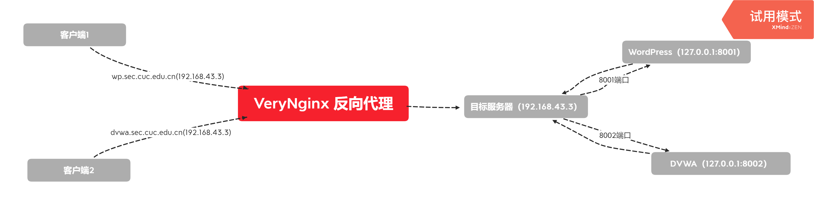

## 实验任务
1. 基本要求
在一台主机（虚拟机）上同时配置Nginx和VeryNginx
- VeryNginx作为本次实验的Web App的反向代理服务器和WAF
- PHP-FPM进程的反向代理配置在nginx服务器上，VeryNginx服务器不直接配置Web站点服务
- 使用Wordpress搭建的站点对外提供访问的地址为： http://wp.sec.cuc.edu.cn
- 使用Damn Vulnerable Web Application (DVWA)搭建的站点对外提供访问的地址为： http://dvwa.sec.cuc.edu.cn


2. 安全加固要求
- 使用IP地址方式均无法访问上述任意站点，并向访客展示自定义的友好错误提示信息页面-1
- Damn Vulnerable Web Application (DVWA)只允许白名单上的访客来源IP，其他来源的IP访问均向访客展示自定义的友好错误提示信息页面-2
- 在不升级Wordpress版本的情况下，通过定制VeryNginx的访问控制策略规则，热修复WordPress < 4.7.1 - Username Enumeration
- 通过配置VeryNginx的Filter规则实现对Damn Vulnerable Web Application (DVWA)的SQL注入实验在低安全等级条件下进行防护

3. VeryNginx配置要求
- VeryNginx的Web管理页面仅允许白名单上的访客来源IP，其他来源的IP访问均向访客展示自定义的友好错误提示信息页面-3
- 通过定制VeryNginx的访问控制策略规则实现：
  - 限制DVWA站点的单IP访问速率为每秒请求数 < 50
  - 限制Wordpress站点的单IP访问速率为每秒请求数 < 20
  - 超过访问频率限制的请求直接返回自定义错误提示信息页面-4
  - 禁止curl访问


## 实验过程

### 环境搭建

**更改Windows主机hosts文件**

```bash
# nginx
192.168.43.3 vn.sec.cuc.edu.cn
192.168.43.3 dvwa.sec.cuc.edu.cn
192.168.43.3 wp.sec.cuc.edu.cn
```
**php**

安装php及相关组件

```bash
sudo apt install php-fpm php-mysql php-curl php-gd php-intl php-mbstring php-soap php-xml php-xmlrpc php-zip
```


**VeryNginx**

**注意 ： 很多命令需要在root权限下操作**

- 安装(安装前可以查看“出现的问题”，安装需要的库)

```bash
# 克隆VeryNginx仓库
git clone https://github.com/alexazhou/VeryNginx.git
cd VeryNginx
# 这里需要提权，以及注意python3
sudo python3 install.py install
```

- 出现的问题

```bash
# 缺少zlib库
sudo apt-get install zlib1g-dev
# 缺少pcre库
sudo apt-get update 
sudo apt-get install libpcre3 libpcre3-dev 
# 缺少cc
sudo apt install cc
# cannot create directory ‘/opt/verynginx’: Permission denied
sudo python3 install.py install
```

- 配置
  
```bash
# 修改 `/opt/verynginx/openresty/nginx/conf/nginx.conf` 配置文件
sudo vim /opt/verynginx/openresty/nginx/conf/nginx.conf


需要修改的：

# 用户名
user  www-data;

# 监听端口
# 这里设置为80端口，稍后修改nginx服务的端口
server {
        listen 192.168.43.3:80;
        
        #this line shoud be include in every server block
        include /opt/verynginx/verynginx/nginx_conf/in_server_block.conf;

        location = / {
            root   html;
            index  index.html index.htm;
        }
    }
```


- 添加Nginx进程的权限

```bash
chmod -R 777 /opt/verynginx/verynginx/configs
```

访问服务器的80端口（192.168.43.3），安装成功
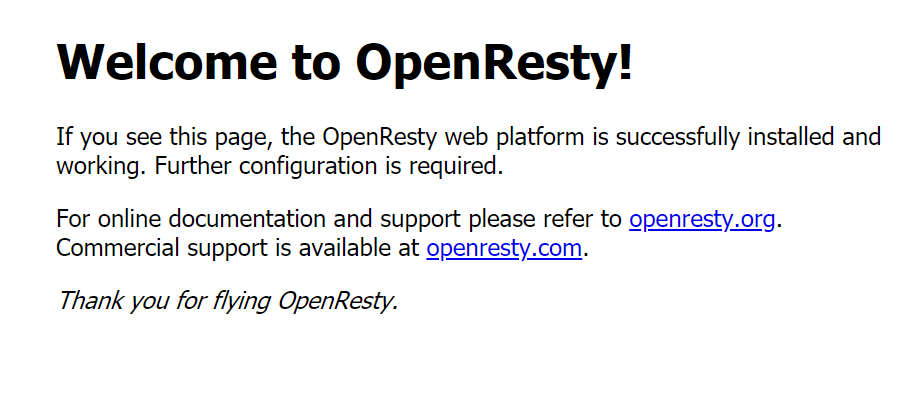

进入到`verynginx/index.html`,默认的用户名和密码都是**verynginx**

**服务相关问题需要用到的命令**

```bash
# 启动
sudo /opt/verynginx/openresty/nginx/sbin/nginx
# 重启
sudo /opt/verynginx/openresty/nginx/sbin/nginx -s reload
# 服务查看
systemctl start/stop/restart/status ×××××
# 这里我创建软链接，下次直接通过`sudo verynginx`启动服务
sudo ln -s /opt/verynginx/openresty/nginx/sbin/nginx /usr/sbin/verynginx
```

登陆成功

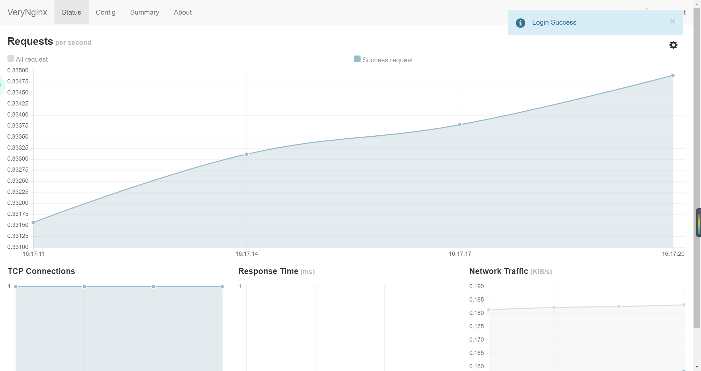


**MySQL**

- 安装

```bash
sudo apt install mysql-server
```

**Nginx**

- 安装
```bash
sudo apt install nginx
```

- nginx目录在/etc/nginx/sites-enabled/

```bash
sudo vim /etc/nginx/sites-enabled/default
```

下面是我的nginx配置文件关键部分
```bash
root /var/www/html/wp.sec.cuc.edu.cn;

  # Add index.php to the list if you are using PHP
  index readme.html index.php;

location ~ \.php$ {
	#	include snippets/fastcgi-php.conf;
	#
	#	# With php-fpm (or other unix sockets):
		fastcgi_pass unix:/var/run/php/php7.4-fpm.sock;
		fastcgi_index index.php;
		fastcgi_param SCRIPT_FILENAME $document_root$fastcgi_script_name;
		include fastcgi_params;
	#	# With php-cgi (or other tcp sockets):
	#	fastcgi_pass 127.0.0.1:9000;
	}
```
需要注意的的是，php部分的配置，默认的php部分被注释掉了，需要我们根据自身情况修改，我下载的是php-fpm，所以修改fpm的部分，其中
```bash
fastcgi_index index.php;
fastcgi_param SCRIPT_FILENAME $document_root$fastcgi_script_name;
include fastcgi_params;
```
是我额外添加的，同时注意这个注释：`Add index.php to the list if you are using PHP`
index readme.html 后添加`index.php`

最终成功解析php

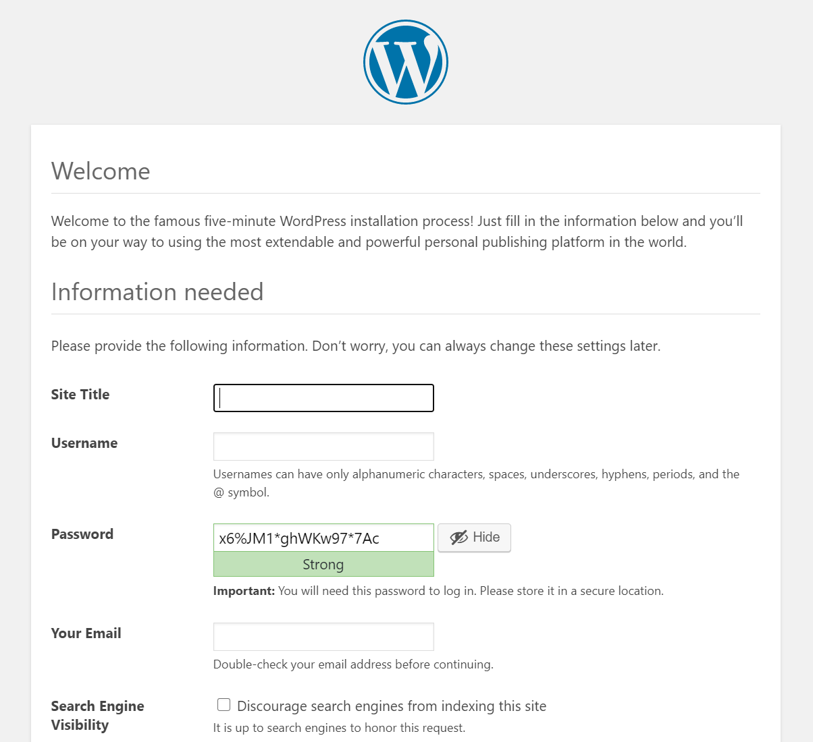

**WordPress**

- 安装与配置

```bash
# 下载安装包
sudo wget https://wordpress.org/wordpress-4.7.zip

# 解压
7z xzvf wordpress-4.7.zip

# 将解压后的wordpress移到指定路径
sudo mkdir /var/www/html/wp.sec.cuc.edu.cn
sudo cp wordpress /var/www/html/wp.sec.cuc.edu.cn

# 将wp-config-sample中的内容修改，然后改名为wp-config
sudo vim wp-config-sample.php
mv wp-config-sample.php wp-config.php
```
- 补充数据库信息

```MySQL
# 登录
sudo mysql
# 建库
CREATE DATABASE wordpress DEFAULT CHARACTER SET utf8 COLLATE utf8_unicode_ci;
# 建用户
create user 'eddie'@'localhost' identified by '123456';
# 授权
grant all on wordpress.* to 'eddie'@'localhost';
```

然后是配置文件的修改
```php
// ** MySQL settings - You can get this info from your web host ** //
/** The name of the database for WordPress */
define('DB_NAME', 'wordpress');

/** MySQL database username */
define('DB_USER', 'eddie');

/** MySQL database password */
define('DB_PASSWORD', '123456');
```

安装完成后就可以进入了

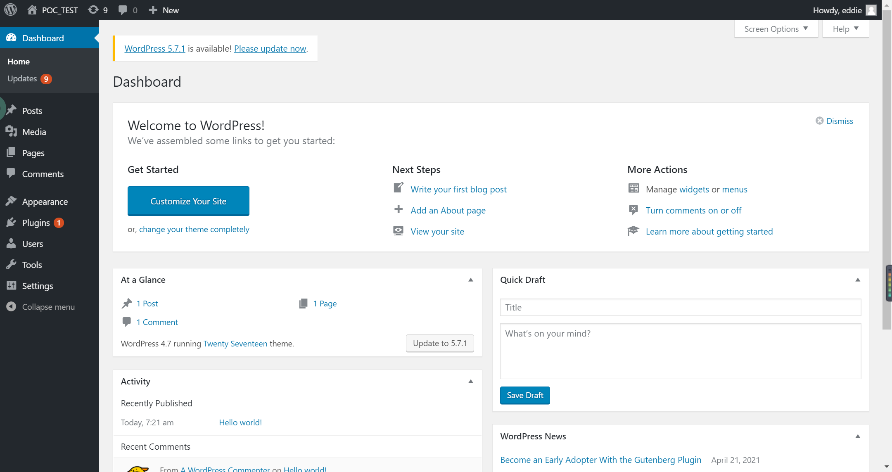

随便敲一些内容

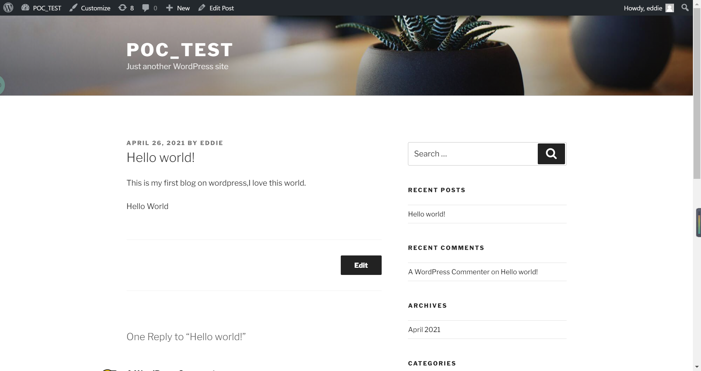

**PHP-FPM进程的反向代理**

创建新的服务器块配置文件

```bash
sudo vim /etc/nginx/sites-available/wp.sec.cuc.edu.cn
```

写入
```bash
server {
	listen 8001 default_server;
	#这里这么写是因为verynginx反向代理开的端口是8001

    # 设置网页的根目录等相关内容
    root /var/www/html/wp.sec.cuc.edu.cn;
    index index.php index.html index.htm index.nginx-debian.html;
    server_name wp.sec.cuc.edu.cn;

    location / {
        # try_files $uri $uri/ =404;
        try_files $uri $uri/ /index.php$is_args$args;

    }
    # 配置反向代理
    location ~ \.php$ {
      include snippets/fastcgi-php.conf;
      fastcgi_pass unix:/var/run/php/php7.4-fpm.sock;
    }

    location ~ /\.ht {
        deny all;
    }
}

```

创建到新服务器块的文件链接

```bash
sudo ln -s /etc/nginx/sites-available/wp.sec.cuc.edu.cn /etc/nginx/sites-enabled/
```

取消链接默认配置文件

```bash
sudo unlink /etc/nginx/sites-enabled/default
```

测试并重启

```bash
sudo nginx -t
sudo systemctl restart nginx.service 
```

结果：
```bash
eddie@kal1:/etc/nginx/sites-available$ sudo nginx -t
nginx: the configuration file /etc/nginx/nginx.conf syntax is ok
nginx: configuration file /etc/nginx/nginx.conf test is successful
```

通过查看服务器日志可知反向代理成功，nginx服务器从127.0.0.1收到请求

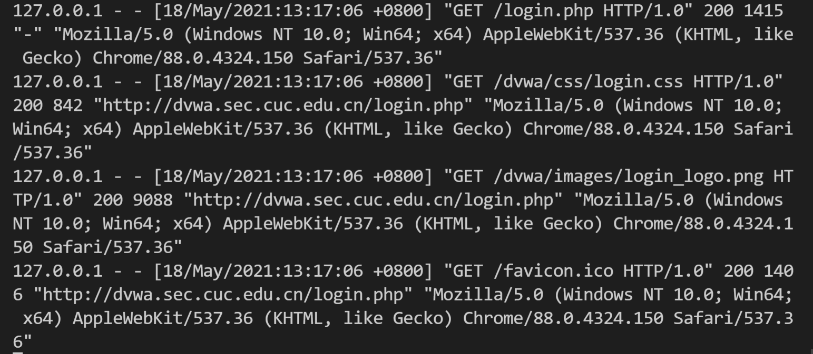


**DVWA**

安装
```bash
# 下载
git clone https://github.com/digininja/DVWA.git
# 建立目录
sudo mkdir /var/www/html/dvwa.sec.cuc.edu.cn
# 把文件夹里面的内容移动到目录下
sudo mv DVWA/* /var/www/html/dvwa.sec.cuc.edu.cn
```

配置MySQL
```bash
sudo mysql
# 下面的内容是mysql语句
mysql> create database dvwa;
Query OK, 1 row affected (0.00 sec)

mysql> create user dvwa@localhost identified by 'p@ssw0rd';
Query OK, 0 rows affected (0.01 sec)

mysql> grant all on dvwa.* to dvwa@localhost;
Query OK, 0 rows affected (0.01 sec)

mysql> flush privileges;
Query OK, 0 rows affected (0.00 sec)

```

配置PHP
```bash
# 将/var/www/html/dvwa.sec.cuc.edu.cn/config/目录下的config.inc.php.dist文件
# 改名为config.inc.php
sudo mv config.inc.php.dist config.inc.php

# 里面的配置都是默认的：
$_DVWA[ 'db_user' ] = 'dvwa';
$_DVWA[ 'db_password' ] = 'p@ssw0rd';
$_DVWA[ 'db_database' ] = 'dvwa';

# 接着修改php-fpm的文件
sudo vim /etc/php/7.4/fpm/php.ini 
# 修改内容
display_errors: Disabled
safe_mode: Disabled
allow_url_include: Enabled
allow_url_fopen: Enabled

#重启php
systemctl restart php7.4-fpm.service
#将所有权分配给www-data用户和组
sudo chown -R www-data.www-data /var/www/html/dvwa.sec.cuc.edu.cn
```

配置服务器块文件
```bash
sudo vim /etc/nginx/sites-available/dvwa.sec.cuc.edu.cn

# 写入
server {
    #listen 8080 default_server;
    #listen [::]:8080 default_server;
	listen 8001 default_server;
	#这里这么写是因为verynginx反向代理开的端口是8001
	
    root /var/www/html/dvwa.sec.cuc.edu.cn;
    index index.php index.html index.htm index.nginx-debian.html;
    server_name dvwa.sec.cuc.edu.cn;

    location / {
        #try_files $uri $uri/ =404;
        try_files $uri $uri/ /index.php$is_args$args;  
    }

    location ~ \.php$ {
        include snippets/fastcgi-php.conf;
        fastcgi_pass unix:/var/run/php/php7.4-fpm.sock;
    }

    location ~ /\.ht {
        deny all;
    }
}

# 新建符号链接

sudo ln -s /etc/nginx/sites-available/dvwa.sec.cuc.edu.cn /etc/nginx/sites-enabled/

# 测试并重启Nginx服务

sudo nginx -t
systemctl restart nginx.service

```

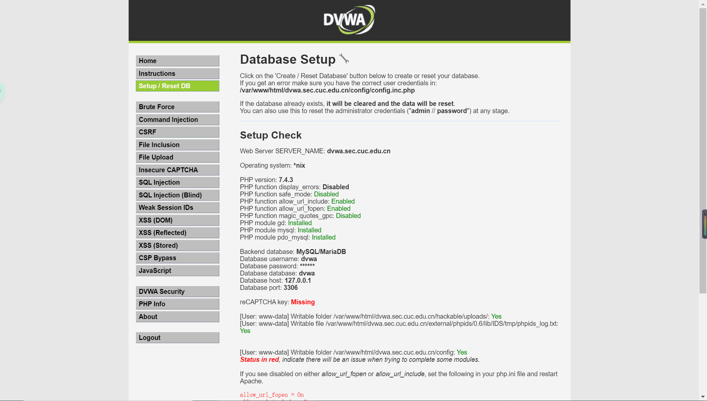


总结

几个重要的配置文件命令

```bash
verynginx的nginx配置文件：
wp的nginx配置文件：
sudo vim /etc/nginx/sites-available/wp.sec.cuc.edu.cn 
dvwa的nginx配置文件：
sudo vim /etc/nginx/sites-available/dvwa.sec.cuc.edu.cn 
遇到错误查看服务器日志：
tail -F /var/log/nginx/access.log
```


### 安全加固要求

1. 使用IP地址方式均无法访问上述任意站点，并向访客展示自定义的友好错误提示信息页面-1

- Matcher

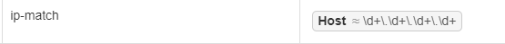


- Response


- Filter

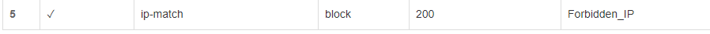

- 结果

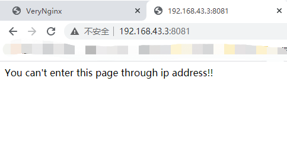


2. Damn Vulnerable Web Application (DVWA)只允许白名单上的访客来源IP，其他来源的IP访问均向访客展示自定义的友好错误提示信息页面-2

- matcher

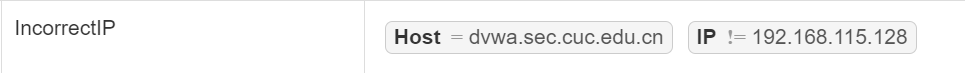

- response

  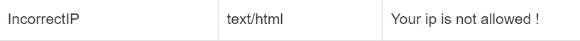


- filter

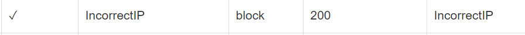

- result

使用白名单以外的ip访问

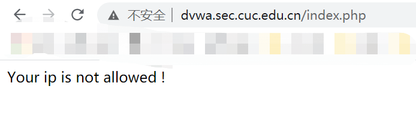

使用白名单ip访问

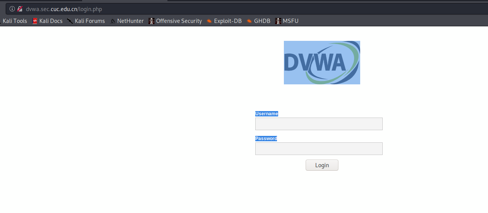

3. 在不升级Wordpress版本的情况下，通过定制VeryNginx的访问控制策略规则，热修复WordPress < 4.7.1 - Username Enumeration


- matcher

  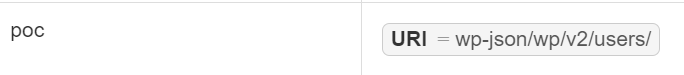


- filter


- result

过滤前：

```
[{"id":1,"name":"eddie","url":"","description":"","link":"http:\/\/192.168.43.3:80\/author\/eddie\/","slug":"eddie","avatar_urls":{"24":"http:\/\/1.gravatar.com\/avatar\/d05c9acf0c799bfd826160e21d02584b?s=24&d=mm&r=g","48":"http:\/\/1.gravatar.com\/avatar\/d05c9acf0c799bfd826160e21d02584b?s=48&d=mm&r=g","96":"http:\/\/1.gravatar.com\/avatar\/d05c9acf0c799bfd826160e21d02584b?s=96&d=mm&r=g"},"meta":[],"_links":{"self":[{"href":"http:\/\/192.168.43.3:80\/wp-json\/wp\/v2\/users\/1"}],"collection":[{"href":"http:\/\/192.168.43.3:80\/wp-json\/wp\/v2\/users"}]}}]
```

过滤后：

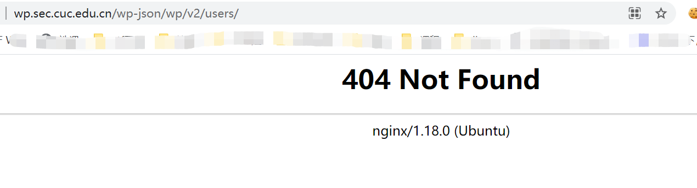


4. 通过配置VeryNginx的Filter规则实现对Damn Vulnerable Web Application (DVWA)的SQL注入实验在低安全等级条件下进行防护

登录DVWA后，选择`DVWA Security`中的`Security Level`为Low，然后选择sql injection，进行sql注入

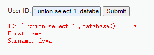

- matcher

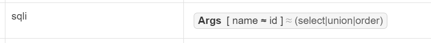

- filter


- result

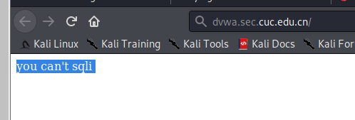


### VeryNginx配置要求

1. VeryNginx的Web管理页面仅允许白名单上的访客来源IP，其他来源的IP访问均向访客展示自定义的友好错误提示信息页面-3

- matcher

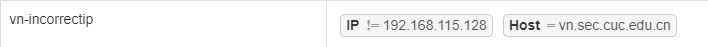

- filter

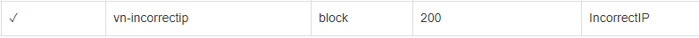

- result

使用白名单以外的ip访问

​	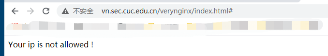

使用白名单ip访问

​	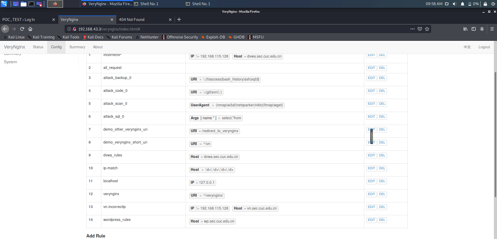


2. 通过定制VeryNginx的访问控制策略规则实现：

- 限制DVWA站点的单IP访问速率为每秒请求数 < 50，Wordpress站点的单IP访问速率为每秒请求数 < 20

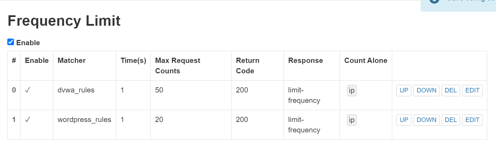

- 超过访问频率限制的请求直接返回自定义错误提示信息页面-4


使用ab压力测试工具可以看到访问wp.sec.cuc.edu.cn了100次，80次都失败了，说明拦截生效

```bash
root@kali:~# ab -n 100 http://wp.sec.cuc.edu.cn/
This is ApacheBench, Version 2.3 <$Revision: 1874286 $>
Copyright 1996 Adam Twiss, Zeus Technology Ltd, http://www.zeustech.net/
Licensed to The Apache Software Foundation, http://www.apache.org/

Benchmarking wp.sec.cuc.edu.cn (be patient).....done


Server Software:        openresty/1.15.8.1
Server Hostname:        wp.sec.cuc.edu.cn
Server Port:            80

Document Path:          /
Document Length:        162 bytes

Concurrency Level:      1
Time taken for tests:   0.264 seconds
Complete requests:      100
Failed requests:        80
   (Connect: 0, Receive: 0, Length: 80, Exceptions: 0)
Non-2xx responses:      20
Total transferred:      19800 bytes
HTML transferred:       4840 bytes
Requests per second:    379.03 [#/sec] (mean)
Time per request:       2.638 [ms] (mean)
Time per request:       2.638 [ms] (mean, across all concurrent requests)
Transfer rate:          73.29 [Kbytes/sec] received

Connection Times (ms)
              min  mean[+/-sd] median   max
Connect:        1    1   1.7      1      14
Processing:     0    1   1.9      1      14
Waiting:        0    1   1.9      1      14
Total:          1    3   2.7      2      16

Percentage of the requests served within a certain time (ms)
  50%      2
  66%      2
  75%      2
  80%      3
  90%      5
  95%      7
  98%     15
  99%     16
 100%     16 (longest request)

```


- 禁止curl访问

查看服务器日志发现，使用curl访问的文件头类似下面：

```bash
127.0.0.1 - - [18/May/2021:18:09:34 +0800] "GET /wordpress/readme.html HTTP/1.0" 200 7433 "-" "curl/7.68.0"
```

- Matcher

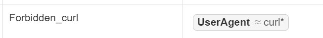

- Filter

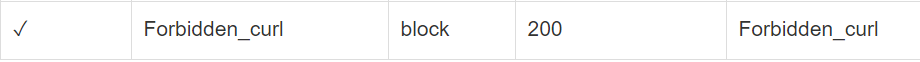

- response


- result

使用过滤前curl可以访问到

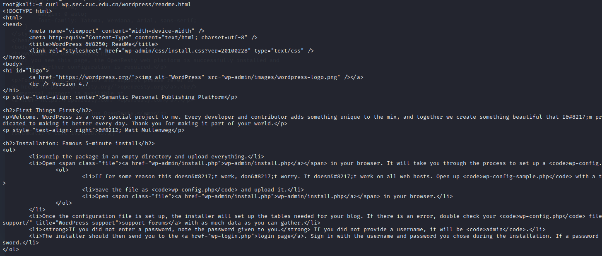

使用过滤后：


## 参考资料：
- [ubantu下安装zlib的方法](https://blog.csdn.net/wsclinux/article/details/50494501)
- [How to Configure Nginx to Execute PHP Using PHP-FPM](https://www.thegeekstuff.com/2013/12/nginx-php-fpm/)
- [Nginx+Php-fpm运行原理 代理与反向代理](https://www.cnblogs.com/wanglijun/p/10867426.html)